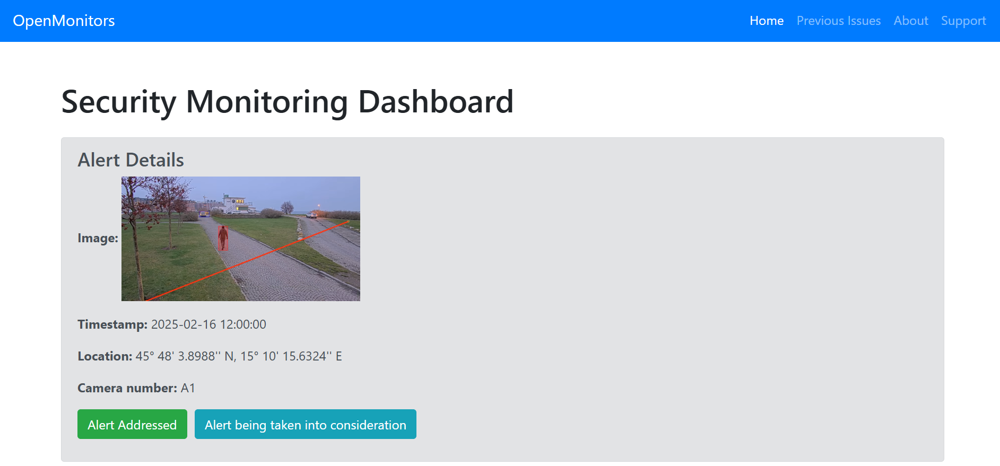

# OpenMonitor (Visual AI Hackathon)

## Project Overview
OpenMonitor is an intelligent security system designed to detect and alert unauthorized access to restricted areas using advanced computer vision techniques. The system continuously monitors designated zones and triggers real-time alerts when unauthorized individuals are detected.

## Key Features
- Real-time video monitoring with object detection
- Instant email/SMS alerts for security breaches
- User-friendly web interface for monitoring and configuration
- Access control management system
- Historical event logging and reporting
- Multi-zone monitoring capabilities

## Interface Preview
The dashboard provides real-time alerts and video feeds:

## Tools Used
- Python
- Django
- OpenCV library
- SQLite3 database
- YOLOv8 model

## Team Members
- Vibhu Dixit: vdixit5@asu.edu  
- Aman Pandey: apand105@asu.edu  
- Khushi Gangrade: kgangrad@asu.edu  
- Amrit Mahajan: amahaj56@asu.edu  
- Kanak Tekwani: kptekwan@asu.edu  
- Aaditya Jindal: ajinda17@asu.edu  